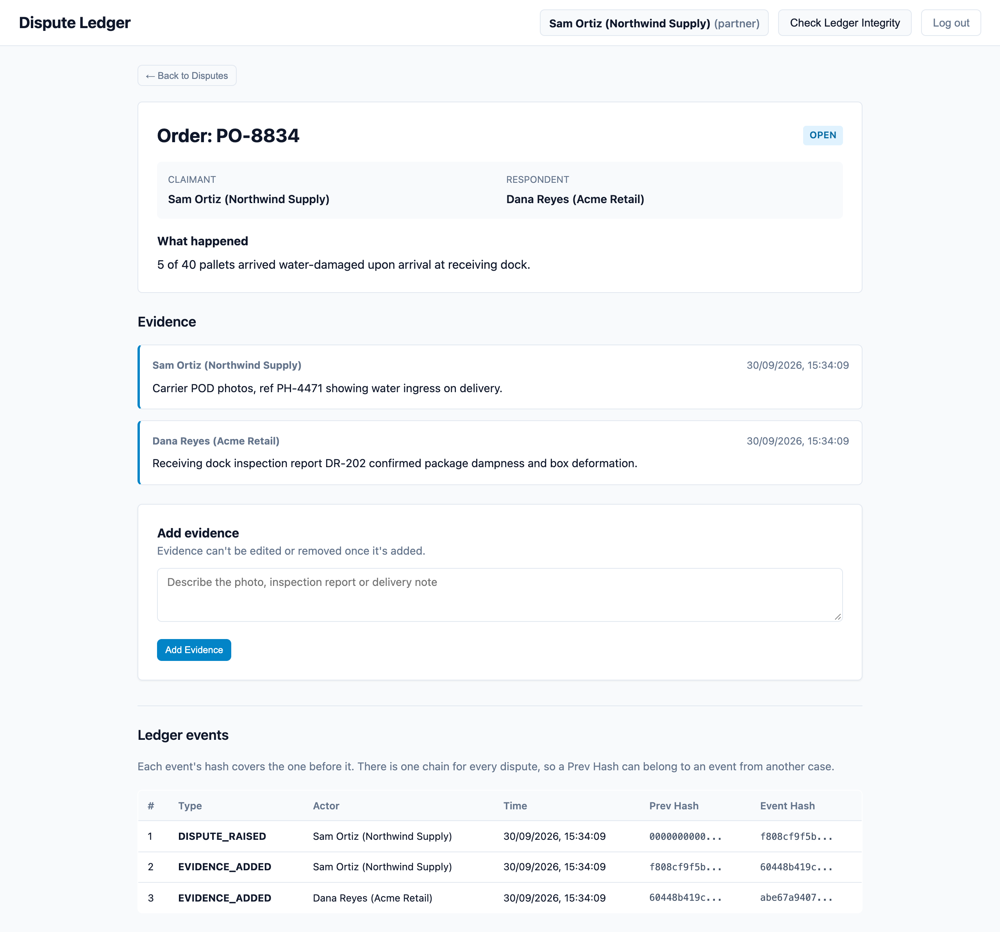
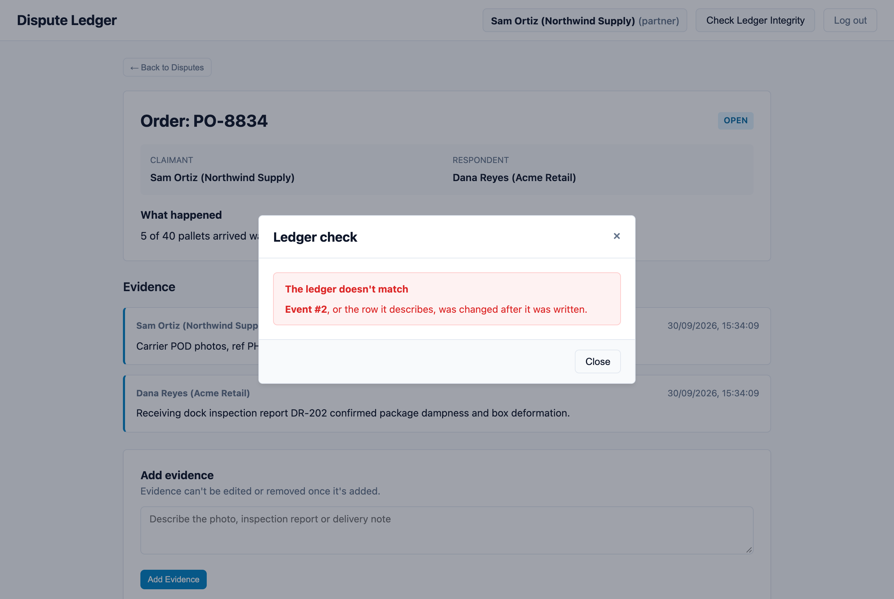

# Dispute Ledger

[](https://github.com/Krish3101/disputeledger/actions/workflows/tests.yml)

A web app for tracking commercial disputes (damaged cargo, short shipments) between
supply chain partners, where the record of what happened can't be quietly altered.

Every change appends an event to an HMAC-SHA256 hash chain, with each event's hash covering
the one before it. Editing a row directly in SQLite breaks the chain, and the integrity check
reports which event was tampered with.

**Stack:** TypeScript on Node.js 22, Express, better-sqlite3, Zod, Vitest with supertest, a plain HTML/CSS/JS frontend, Render.

**Live demo:** <https://disputeledger.onrender.com>. Log in with the quick buttons; the demo
resets every time the free server restarts, and the first load can take about a minute.



## What the chain proves, and what it doesn't

It shows a row hasn't been edited directly in the database. Each event's hash covers the
previous event's hash, so changing anything in the middle invalidates every event after it,
and recomputing the chain finds exactly where.

It can't see the end being cut off. Delete the newest event together with the row it
describes, and what's left is still a valid chain. Catching that needs the latest hash kept
somewhere outside the database, which this doesn't do.

The hashes are keyed with `LEDGER_KEY`, which lives in `.env` and not in the database. Without
it, someone who edits a row can't recompute a chain that passes, even if they rehash every
event after the edit. Plain SHA-256 wouldn't stop that, which is why the key is there. It only
helps while the key stays secret: whoever has both the database and `.env` can still rewrite
history.

It does not make anyone honest. The app writes the chain itself, so whoever can run the app
can append whatever they like at the time. This catches tampering with history; it does
nothing about a lie recorded truthfully.

There is no blockchain here and no distributed consensus. It is one SQLite file with a
verifiable append-only log over it.

## Catching a tamper

With the server running, edit the database underneath it:

```bash
sqlite3 dispute.db "UPDATE evidence SET notes='never happened' WHERE id=(SELECT id FROM evidence LIMIT 1);"
```

Then click **Check Ledger Integrity**. It recomputes the chain and names the event that no
longer matches.



Each state change writes its event inside the same SQLite transaction as the change itself,
so the ledger can't drift from the data it describes.

## The four roles

Seeded accounts, password `password123` for all of them:

| user | role | acting as |
|---|---|---|
| `supplier` | partner | Sam Ortiz, Northwind Supply |
| `buyer` | partner | Dana Reyes, Acme Retail |
| `carrier` | partner | Chris Vance, Pacific Freight |
| `arbiter` | arbiter | Ari Lund, Meridian Arbitration |

Log in as `supplier`, raise a dispute against Dana Reyes, and add an evidence note. Log in
as `buyer` and add counter-evidence. Log in as `carrier`: the dispute isn't in the list,
and opening its URL gives a 404 rather than a 403, so an uninvolved partner can't even
confirm it exists. Log in as `arbiter` and record a ruling; the dispute moves to `RESOLVED`
and stops accepting evidence.

A dispute goes `OPEN` once and `RESOLVED` once. Only an arbiter can close it, and nothing
can be added afterwards.

Passwords use `scrypt` from `node:crypto` and are compared with `timingSafeEqual`, so a
wrong password and an unknown username take the same time to reject.

## Running it

Needs Node.js 22 or newer.

```bash
./scripts/start.sh
```

That generates a `LEDGER_KEY` into `.env` the first time, installs dependencies if needed,
seeds the database, and starts the server at http://localhost:3000. To do it by hand:

```bash
npm install
cp .env.example .env    # then set LEDGER_KEY to any long random string
npm run seed            # 4 users, 2 disputes
npm run dev
npm test
```

`npm run reset` wipes and reseeds.

TypeScript runs directly through `tsx` with no build step, and the frontend is plain HTML,
CSS and ES modules, so there's no bundler either.

```
src/
  domain.ts     dispute rules and error types, no I/O
  audit.ts      hash chain and integrity verification
  auth.ts       scrypt hashing, session tokens
  db.ts         SQLite schema and indices
  disputes.ts   queries and dispute operations
  routes.ts     endpoints and Zod validation
  app.ts        builds the Express app (exported so tests can drive it)
  main.ts       starts the server, handles shutdown
  seed.ts       demo users and disputes
public/         single-page frontend
tests/          domain rules and API tests
```

## Deploying

`render.yaml` runs it on Render's free plan: New → Blueprint → this repo. Render generates
`LEDGER_KEY`, and because the free plan wipes the disk on every restart, the demo reseeds
itself each time it starts.

## Still missing

Evidence is text notes only. The walkthrough talks about photos of water ingress, but
there's no file upload, so you describe the photo rather than attach it, which is the main
thing I'd add next.

## License

[MIT](LICENSE)
